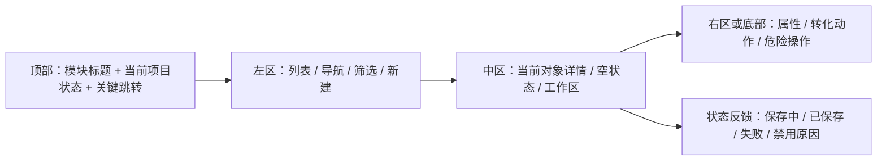

# 阶段 37A：非写作 / 非阅读模块 UI 产品化设计规格

日期：2026-07-02

本规格只做设计与任务拆解，不直接修改产品代码。后续实现按 37B、37C、37D 分批交给 OpenCode，Codex 负责验收和兜底。

## 1. 当前判断

写作页和阅读页经过多轮打磨，已经有比较明确的使用场景和视觉重心。其他模块虽然功能可用，但仍然像“把功能入口放上去了”，缺少成熟桌面软件的模块结构。

核心问题：

- 模块之间缺少统一页面骨架，导致书库、资料库、Workshop、Workflow、恢复、设置看起来像不同产品。
- 第一屏主操作不够稳定，有的页面主操作很明确，有的页面是按钮堆叠。
- 空状态多是提示文字，缺少可执行下一步。
- 资料库、Workshop、Workflow 明明服务于写作上下文，但 UI 上仍像孤立工具。
- 设置页功能变多后，大表单感重新出现。
- 恢复中心可用，但视觉上没有足够的安全感和确认感。

基线截图已保存：

- `.ai_state/test_reports/phase37_design_baseline/bookshelf-1366.png`
- `.ai_state/test_reports/phase37_design_baseline/compendium-1366.png`
- `.ai_state/test_reports/phase37_design_baseline/workshop-1366.png`
- `.ai_state/test_reports/phase37_design_baseline/workflow-1366.png`
- `.ai_state/test_reports/phase37_design_baseline/recovery-1366.png`
- `.ai_state/test_reports/phase37_design_baseline/settings-1366.png`

## 2. 统一模块骨架

阶段 37 后，非写作 / 非阅读模块尽量遵守同一套页面语言：

每个模块都必须明确：

- 当前项目：是否已打开项目，项目名是什么。
- 当前对象：当前作品、资料卡、对话、工作流、备份或配置组。
- 主操作：这一页最常用的一个动作。
- 次操作：常用但不该压过主操作的动作。
- 危险操作：删除、替换、移出、覆盖，必须分离。
- 空状态：无项目、无数据、未选择、加载失败、正在加载。

## 3. 模块设计规格

### 3.1 书库

定位：作品入口，而不是文件管理器。

现状问题：

- 左侧工作台已有改善，但仍有“导入 / 维护”按钮堆叠感。
- 项目卡继续写作入口已经出现，但卡片还可以更有作品感。
- 无项目状态应该鼓励“新建第一部作品”或“导入已有作品”，而不是只说明没有项目。

目标结构：

- 左侧分为三个固定区：创作入口、导入迁移、维护。
- 右侧为作品架：搜索 / 排序 / 项目卡网格。
- 项目卡主操作固定为“继续写作”，次操作为“编辑信息”和“更多”。
- 危险操作“移出书库”只在更多区域底部出现，视觉上和普通操作分离。

第一屏验收：

- 1366x768 下左侧不出现按钮挤压。
- 无项目时右侧是可执行空状态，至少有“新建作品”和“导入项目”两个动作。
- 有项目时卡片第一眼能看到：标题、字数、章节/场景、最近保存、继续写作。

### 3.2 资料库

定位：写作上下文控制台，而不是资料表单页。

现状问题：

- 左侧列表和右侧表单功能完整，但编辑器太像数据库表单。
- 注入策略、触发条件、人物卡字段同时出现时层级容易乱。
- 用户需要理解“这张卡什么时候进入提示词”，UI 没有足够直接地表达。

目标结构：

- 左侧：资料检索 + 类型筛选 + 新建按钮 + 资料卡列表。
- 中间：资料正文编辑，突出标题、摘要、正文。
- 右侧或详情侧栏：上下文注入策略、触发条件、人物结构字段。
- 卡片列表显示注入状态 badge：不自动 / 提及时 / 自动 / 总是。
- 人物卡字段做成“人物约束”分组，只有 type=character 时展开。

第一屏验收：

- 未打开项目时只显示项目引导，不显示一堆 disabled 表单。
- 未选择资料时详情区显示“选择资料或新建资料”的空状态。
- 选择人物卡后，能清楚看到“资料内容”和“写作约束”是两类信息。
- 注入策略修改后，旧 checkbox 与新策略不产生视觉冲突。

### 3.3 Workshop

定位：创作讨论与输出转化空间，而不是普通聊天页。

现状问题：

- 对话消息区偏空，输入区和转化动作缺少创作工具感。
- 输出转资料 / 写摘要 / 插正文是核心价值，但现在像附属按钮。
- 没有项目时的引导不够强，用户容易不知道先做什么。

目标结构：

- 左侧：对话列表 + 新对话 + 当前项目摘要。
- 中区：消息流，用户消息和助手消息视觉区分明显。
- 底部：输入区，支持引用提示（资料、场景）。
- 右侧或消息下方：选中助手输出后的“转化面板”，包含转资料、写摘要、插入正文。
- 转化动作应先显示预览和目标位置，后续可补确认弹窗。

第一屏验收：

- 无项目时显示“先打开项目”的明确入口。
- 无对话时主区域显示“创建第一场讨论”，而不是空消息框。
- 有助手输出时，转化动作比普通删除对话更醒目。

### 3.4 Workflow

定位：创作流程看板，而不是流程引擎调试面板。

现状问题：

- 左侧 brief + 开始按钮可用，但整体偏技术流程。
- 步骤、产物、事件日志混在同一个工作台里，用户难以判断下一步。
- 批准 / 退回 / 采纳草稿是流程动作，应该围绕当前步骤组织。

目标结构：

- 左侧：运行列表 + 新工作流 brief。
- 中区：流程步骤看板，显示当前步骤、已完成步骤、等待用户步骤。
- 右区或下区：当前步骤产物预览和操作栏。
- 事件日志折叠到次级区域，默认不抢视觉重心。
- 当前可执行动作固定在当前步骤附近：生成、采纳、批准、退回。

第一屏验收：

- 未打开项目时清楚说明工作流依赖项目。
- 无运行时展示 4 步流程说明，但不占满整个页面。
- 有运行时第一眼能看出“当前卡在哪一步”和“下一步点哪个按钮”。

### 3.5 恢复中心

定位：安全恢复，而不是备份列表。

现状问题：

- 备份列表和预览能用，但“替换原项目”等危险操作视觉上需要更安全。
- 没有备份时不应像空页面。
- 差异预览、恢复范围、目标项目需要更明确。

目标结构：

- 左侧：搜索 / 筛选 / 备份列表。
- 中区：备份摘要、项目、时间、原因、包含内容。
- 右侧或底部：恢复操作区，分为安全操作和危险操作。
- 替换原项目必须放入危险区，并配合确认文本。

第一屏验收：

- 无备份时显示备份位置和刷新入口。
- 选择备份后先看到“将恢复什么”，再看到按钮。
- “恢复为新项目”视觉优先级高于“替换原项目”。

### 3.6 设置

定位：配置中心，而不是大表单。

现状问题：

- Provider、配置组、生成默认值、朗读已分区，但仍偏表单。
- API 配置组是高级能力，应该有状态摘要和可用性提示。
- 写作页模型选择依赖已配置 API，设置页需要更清楚地表达“哪些配置可用于写作”。

目标结构：

- 左侧：设置分类导航，带状态摘要：AI 连接、模型档案、生成参数、朗读、路径/维护。
- 中区：当前分类内容。
- 每个配置组卡片显示：名称、厂商、模型、endpoint 简写、密钥状态、测试状态、是否可用于写作。
- 新建/编辑配置组使用局部编辑器或抽屉式区域，不让整页变成长表单。
- 全局 Provider 与写作页可选配置组之间的关系要明确。

第一屏验收：

- 用户能在 5 秒内找到“添加 DeepSeek API”和“测试配置”。
- 配置组能看出是否已经保存 API Key。
- 不可用于写作的 provider 不应伪装成可用选项。

## 4. 跨模块状态规范

所有阶段 37 模块应覆盖这些状态：

- 无项目：显示“去书库打开 / 新建项目”，隐藏或弱化依赖项目的表单。
- 有项目但无数据：显示该模块的第一步动作。
- 有数据未选择：显示列表和选择提示。
- 已选择：显示详情和可用操作。
- 加载中：保留布局骨架，不跳动。
- 保存中 / 已保存 / 保存失败：状态反馈在当前模块内就近出现。
- 禁用：按钮 disabled 时必须能从附近文案理解原因。

## 5. 实现拆分

### 37B：书库 + 资料库

优先原因：这是写作前后的核心入口。书库决定用户从哪里进入作品，资料库决定上下文质量。

允许改动：

- `desktop.html`
- `src/styles/desktop.css`
- `src/desktop/desktop-shell.js`
- `tests/desktop-library.js`
- `tests/writer-button-audit.js`

必须保留：

- 项目新建、导入、刷新、打开、编辑信息、更多操作、移出书库。
- 资料新建、编辑、删除、保存、注入策略、人物字段、搜索、类型筛选。

### 37C：Workshop + Workflow

优先原因：这两个模块最容易显得像调试工具，需要改成创作辅助空间。

允许改动同上。

必须保留：

- 新建对话、发送消息、转资料、写摘要、插正文。
- 新建工作流、生成步骤、采纳草稿、批准、退回、取消、事件记录。

### 37D：恢复中心 + 设置

优先原因：这两个模块承担安全和配置，产品感来自清晰、稳定和可信。

允许改动同上。

必须保留：

- 备份搜索、筛选、预览、恢复场景、恢复为新项目、替换原项目。
- Provider 保存、配置测试、配置组新增/编辑/删除/测试、朗读设置、生成默认值。

## 6. 验收方式

每个子阶段完成后：

- `npm run desktop-mainline-test`
- 触及资料库 / 设置 / 写作上下文时运行 `npm run writer-audit`
- 阶段总收口运行 `npm run unit`
- Playwright 截图：1366x768、1920x1080、2560x1440
- 检查项：无横向溢出、主按钮完整可见、危险操作分离、空状态可执行、模块第一屏目标明确
